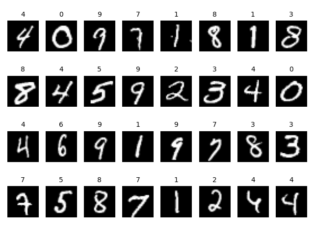
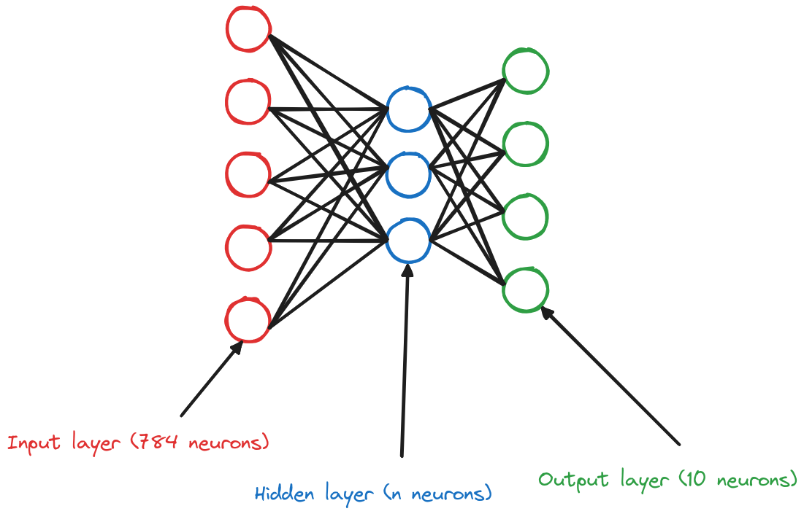

# MNIST NUMPY

    

## SUMMARY

This repository contains a Perceptron implementation using NumPy. There are no hidden details in the implementation, meaning that the work focuses more on the learning process rather than on how "clean" or "abstract" the implementation is. The task is to classify handwritten digits using the Perceptron.

## ARCHITECTURE

The Perceptron has **3 layers**: the input layer with **784 neurons** (28x28), a hidden layer with **n** neurons (n is a hyperparameter), and the output layer with **10 neurons** (10 classes).
Below is a simple representation of the architecture.

    

## TRAINING PROCESS

The learning process can be divided into **4 parts** that we repeat **e** epochs.

### Forward Propagation

The forward propagation consists of 3 steps in our case:

1. Compute $\hat{y}$ by following the formula: $$\hat{y} = Wx + b$$ where $x$ is the flattened input **(mx784)**, $W$ the weights **(784xn)**, and $b$ the bias **(1xn)**. The output of this operation will have a shape of **(mxn)**.

2. The linear operation is followed by an **"activation"** function, in our case [ReLU](<https://en.wikipedia.org/wiki/Rectifier_(neural_networks)>), that can be seen as if a neuron is **"fired or not"**. ReLU equation is:

   $$
   f(x) =
   \begin{cases}
   x & \text{if } x > 0,\\
   0 & \text{otherwise}
   \end{cases}
   $$

   Note that the shape of the input remains unchanged after this operation.

3. We apply the linear operation again to the output of ReLU, this time $W$ has the shape **(nx10)**, where 10 is the number of classes in MNIST.

4. The last linear operation is followed by a [Softmax](https://en.wikipedia.org/wiki/Softmax_function) function that will turn the output of the linear operation (logits) into class probabilities. Below is the formula to compute Softmax:

   $$
   sigma =
   $$

### Metrics Computing

After the forward propagation, the loss and accuracy are computed. The loss is a way to quantify "how much error" the Perceptron makes. To compute the error, we use the Negative Log-Likelihood (NLL):

$$
L_i = -\sum_j y_{i,j} \log(\hat{y}_{i,j})
$$

The accuracy is also computed as it is an easier metric to understand:

$$
\text{Accuracy} = \frac{1}{k} \sum_{i=1}^{k} (\hat{y}_i == y_i)
$$

Here, $\hat{y}_i$ and $y_i$ are binary.

### Backward Propagation
